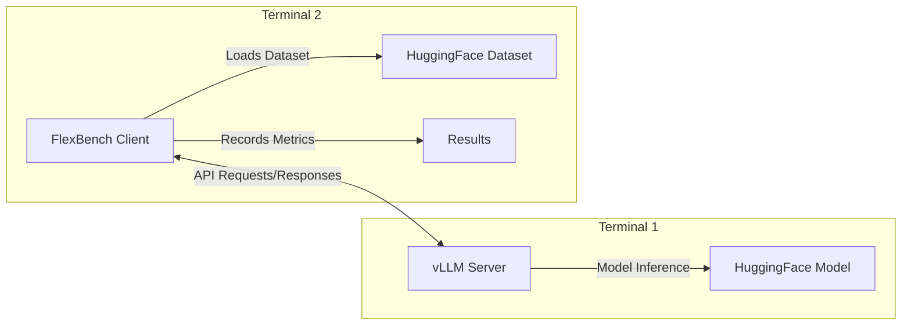

# FlexBench

A flexible benchmarking framework for language and vision models, with support for both MLPerf loadgen and vLLM backends.

For reference: [MLPerf Inference Benchmark](https://arxiv.org/pdf/1911.02549)

## Features

- 🚀 Support for both Server (streaming) and Offline (batched) inference modes
- 🔄 Compatible with any HuggingFace model and dataset
- 🎯 MLPerf-compliant benchmarking with loadgen
- 🔍 Performance and accuracy evaluation
- 📊 Detailed metrics including TTFT, throughput, and latency percentiles
- 📈 QPS sweep mode for discovering performance characteristics

## Architecture

FlexBench uses a client-server architecture where the client (FlexBench) connects to a running vLLM server:



**Important:** The vLLM server and FlexBench client run in separate terminals. You must start the vLLM server first, then run FlexBench in another terminal.

## Quick Start

### Installation

Using uv (recommended, more stable):

```sh
# Optional: install uv
curl -LsSf https://astral.sh/uv/install.sh | sh

# Setup environment
uv sync
source .venv/bin/activate
uv pip install -e .              # Basic installation for remote endpoints
# uv pip install -e ".[local]"   # For local model inference deployment
```

Using standard venv:

```sh
# Setup environment
python -m venv .venv
source .venv/bin/activate
pip install -e .                 # Basic installation for remote endpoints
# pip install -e ".[local]"      # For local model inference deployment
```

The `[local]` option installs additional dependencies required for local model inference with vLLM.

## Model & Dataset Support

### Models

FlexBench works with any HuggingFace model, with specialized chat templates for:

- Llama2 models (`meta-llama/Llama-2-*`)
- Llama3 models (`meta-llama/Llama-3-*`)
- DeepSeek models (`deepseek-ai/DeepSeek-*`)

### Dataset Support

#### Text Tasks

- Configurable column mapping for input text, output text, and system prompts
- Examples: `ctuning/MLPerf-OpenOrca`, `Open-Orca/OpenOrca`

#### Vision Tasks

- Support for `philschmid/amazon-product-descriptions-vlm` (Beta)

## Usage

### Terminal 1: Start a vLLM Server

First, start the vLLM server in one terminal:

Single GPU:

```sh
vllm serve HuggingFaceTB/SmolLM2-135M-Instruct --disable-log-requests --max-model-len=2048
```

Multi-GPU:

```sh
CUDA_VISIBLE_DEVICES=0,1,2,3 vllm serve HuggingFaceTB/SmolLM2-135M-Instruct --disable-log-requests --max-model-len=2048 --tensor-parallel-size 4
```

### Terminal 2: Run FlexBench

WARNING: ensure the vLLM server is running before executing FlexBench

In a second terminal, run FlexBench to connect to the vLLM server:

```sh
# Standard mode with target QPS
python -m flexbench \
    --task text \
    --model-path HuggingFaceTB/SmolLM2-135M-Instruct \
    --api-server http://localhost:8000 \
    --scenario Server \
    --target-qps 10 \
    --dataset-path ctuning/MLPerf-OpenOrca \
    --dataset-input-column question \
    --dataset-output-column response \
    --dataset-system-prompt-column system_prompt \
    --total-sample-count 100
```

For sweep mode to discover performance characteristics:

```sh
python -m flexbench \
    --task text \
    --model-path HuggingFaceTB/SmolLM2-135M-Instruct \
    --api-server http://localhost:8000 \
    --scenario Server \
    --sweep \
    --num-points 20 \
    --dataset-path ctuning/MLPerf-OpenOrca \
    --dataset-input-column question \
    --dataset-output-column response \
    --dataset-system-prompt-column system_prompt \
    --total-sample-count 100
```

Note: use `LOG_LEVEL=DEBUG` env variable to enable debug logging.

## Key Parameters

| Parameter | Description | Available Options |
|-----------|-------------|-------------------|
| `--task` | Task type | `text`, `vision` |
| `--scenario` | MLPerf scenario | `Server` (streaming), `Offline` (batched) |
| `--backend` | Benchmark implementation | `loadgen` (MLPerf-compliant), `vllm` (direct) |
| `--accuracy` | Evaluation mode | Flag to enable accuracy mode (default: performance) |
| `--target-qps` | Target query rate to achieve | Float |
| `--sweep` | Sweep mode | Flag to enable QPS sweep mode (incompatible with --target-qps) |
| `--num-points` | Number of QPS points in sweep | Integer (default: 10) |
| `--batch-size` | Batch size, for Offline mode only | Integer |

## Additional Options

For dataset configuration:

- `--dataset-input-column`: Input text column (required)
- `--dataset-output-column`: Reference text column (for accuracy mode)
- `--dataset-system-prompt-column`: System prompt column (optional)
- `--dataset-image-column`: Image column (for vision tasks)

For API configuration:

- `--api-server`: vLLM server URL
- `--api-token`: Authentication token for remote endpoints

## Testing & Development

Run tests with:

```sh
pytest . -v -s
```

## Authors

Daniel Altunay and Grigori Fursin (FCS Labs)
