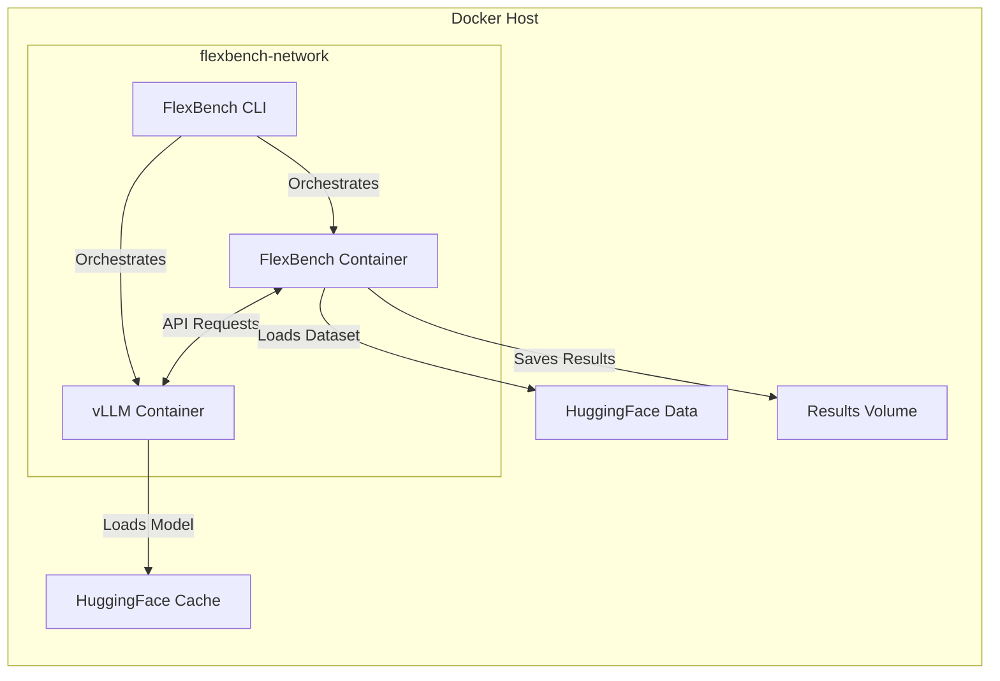
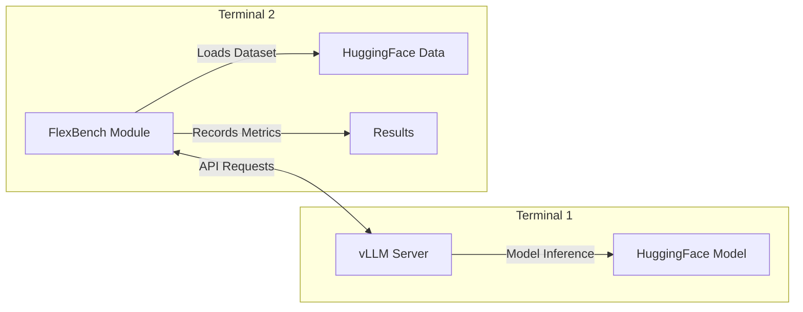

# FlexBench

A flexible benchmarking framework for language and vision models with automated Docker orchestration and MLPerf-compliant evaluation.

## Features

- **Automated Docker orchestration** - Zero-setup benchmarking with container management
- **MLPerf-compliant scenarios** - Server, Offline, and SingleStream inference modes
- **Universal model support** - Compatible with any HuggingFace model and dataset
- **Performance & accuracy evaluation** - Comprehensive metrics and validation
- **Detailed analytics** - TTFT, throughput, latency percentiles, and more
- **QPS sweep mode** - Automatic performance curve discovery
- **GPU resource management** - Automatic device allocation and memory limits

## Installation

```bash
# Recommended: Install with uv (faster and more reliable)
curl -LsSf https://astral.sh/uv/install.sh | sh
git clone https://github.com/flexaihq/flexbench.git
cd flexbench
uv venv .venv
source .venv/bin/activate
uv pip install -e .

# Alternative: Direct install from GitHub with uv
curl -LsSf https://astral.sh/uv/install.sh | sh
uv pip install git+https://github.com/flexaihq/flexbench.git

# Alternative: Using regular pip (requires Python 3.12+)
git clone https://github.com/flexaihq/flexbench.git
cd flexbench
python -m venv .venv
source .venv/bin/activate
pip install -e .
```

## Prerequisites

- **Docker** and **Docker Compose** (or `docker compose`)
- **NVIDIA Docker runtime** (for GPU support)

## Quick Start

FlexBench automatically handles all container orchestration. Run the CLI with your desired configuration:

```bash
# Simple performance benchmark
flexbench --task text \
          --model-path HuggingFaceTB/SmolLM2-135M-Instruct \
          --scenario Server \
          --target-qps 10 \
          --dataset-path ctuning/MLPerf-OpenOrca \
          --dataset-input-column question \
          --total-sample-count 100

# Sweep mode to find performance limits
flexbench --task text \
          --model-path meta-llama/Llama-2-7b-chat-hf \
          --scenario Server \
          --sweep \
          --dataset-path ctuning/MLPerf-OpenOrca \
          --dataset-input-column question

# Accuracy evaluation
flexbench --task text \
          --model-path HuggingFaceTB/SmolLM2-135M-Instruct \
          --scenario Server \
          --target-qps 5 \
          --accuracy \
          --dataset-path ctuning/MLPerf-OpenOrca \
          --dataset-input-column question \
          --dataset-output-column response
```

FlexBench automatically manages the complete benchmark lifecycle, including pulling Docker images, starting containers with proper networking and GPU allocation, loading models, running benchmarks, collecting results, and cleaning up containers. All detailed metrics are saved to the results directory.

## Architecture

FlexBench provides two deployment modes:

### CLI Mode (Recommended)

Automated Docker orchestration with zero manual setup:



**Benefits:**
- **Zero setup** - Automatic container management
- **Isolated environments** - Reproducible benchmarks
- **GPU resource management** - Automatic device allocation
- **Dependency isolation** - No conflicts with host environment
- **Production ready** - Easy deployment and scaling

### Module Mode (Advanced)

Direct Python API for development and custom integrations:



**Benefits:**
- **Full control** - Custom vLLM server configurations
- **Easy debugging** - Direct access to all APIs
- **Development friendly** - Faster iteration cycles
- **Integration ready** - Embed in existing systems

> **For module usage:** See [Module Documentation](src/flexbench/README.md) for detailed setup and advanced usage patterns.

## Inference Scenarios

FlexBench supports multiple inference scenarios based on MLPerf standards:

| Scenario       | Description                                                                 | Load Generation                                                                       | Use Case                        |
|----------------|-----------------------------------------------------------------------------|---------------------------------------------------------------------------------------|----------------------------------|
| **Server**     | Queries arrive following a Poisson distribution, mimicking real-world load. |              | Online serving, latency testing  |
| **Offline**    | All queries are sent at once, maximizing throughput.                        |            | Throughput benchmarking          |
| **SingleStream** | Queries are processed one at a time, measuring sequential latency (90th percentile). |       | Real-time, interactive, or mobile inference (e.g., autocomplete, AR) |

For more details on the MLPerf Inference Benchmark and the design of modes and metrics, refer to the [MLPerf Inference Benchmark paper](https://arxiv.org/pdf/1911.02549).

## GPU Configuration

FlexBench provides flexible GPU management options:

```bash
# Use specific GPUs
flexbench --gpu-devices 0,1,2 \
          --task text \
          --model-path HuggingFaceTB/SmolLM2-135M-Instruct \
          --scenario Server \
          --target-qps 10

# Use first N GPUs
flexbench --gpu-count 4 \
          --task text \
          --model-path meta-llama/Llama-2-7b-chat-hf \
          --scenario Server \
          --sweep

# Custom memory limits
flexbench --vllm-memory-limit 16g \
          --task text \
          --model-path HuggingFaceTB/SmolLM2-135M-Instruct \
          --scenario Server \
          --target-qps 10
```

## Key Parameters

### Core Benchmark Parameters

| Parameter | Description | Available Options |
|-----------|-------------|-------------------|
| `--task` | Task type | `text`, `vision` (in development) |
| `--scenario` | MLPerf scenario | `Server`, `Offline`, `SingleStream` |
| `--backend` | Benchmark implementation | `loadgen` (MLPerf-compliant), `vllm` (direct - in development) |
| `--accuracy` | Evaluation mode | Flag to enable accuracy mode (default: performance). Needs `--dataset-output-column` to be set. Not compatible with `--sweep`. |
| `--dataset-output-column` | Reference text column (for accuracy mode) | String |
| `--target-qps` | Target query rate to achieve | Float |
| `--sweep` | Sweep mode | Flag to enable QPS sweep mode (incompatible with `--target-qps` and `--accuracy`). Automatically tests multiple QPS levels to discover performance limits and saturation points. |
| `--num-points` | Number of QPS points in sweep | Integer (default: 10) |
| `--batch-size` | Batch size, for Offline mode only | Integer |
| `--max-input-tokens` | Maximum number of tokens for input | Integer (longer inputs will be truncated) |
| `--fixed-input-length` | Fixed input length flag | Flag to pad inputs to exactly `--max-input-tokens` length |

### CLI-Specific Parameters (Docker Mode Only)

| Parameter | Description | Available Options |
|-----------|-------------|-------------------|
| `--gpu-devices` | Specific GPU devices to use | Comma-separated list (e.g., `0,1,2`) |
| `--gpu-count` | Number of GPUs to use | Integer (uses first N GPUs) |
| `--vllm-image` | vLLM Docker image | String (default: `vllm/vllm-openai:latest`) |
| `--flexbench-image` | FlexBench Docker image | String (default: `flexbench:latest`) |
| `--model-cache-dir` | Host directory for model cache | Path (default: `~/.cache/huggingface`) |
| `--vllm-memory-limit` | Memory limit for vLLM container | String (e.g., `16g`) |
| `--no-cleanup` | Don't remove containers after run | Flag (useful for debugging) |
| `--no-pull` | Don't pull latest images | Flag |
| `--dry-run` | Show configuration without running | Flag |

For more details on each parameter, use `flexbench --help`.

### Sweep Mode

Sweep mode automates the process of finding your model's performance curve by:

1. First determining the maximum throughput your model can handle
2. Then testing a range of QPS values (from low to high) to map the complete performance profile
3. Capturing metrics like latency and throughput at each level to identify optimal operating points

This is useful for capacity planning and understanding how your model performs under various load conditions. Results include comprehensive metrics at each tested QPS level.

### Offline Mode Batching Behavior

In Offline mode, the `--batch-size` parameter controls query processing:

- **Default (no value specified)**: All samples processed as a single batch for maximum throughput
- **Custom value**: All queries are still received at once, but processed in smaller chunks:
  - Queries divided into batches of specified size
  - Multiple worker threads process these batches in parallel
  - Each batch becomes a separate API call to the inference server

This maintains MLPerf methodology (submitting all queries at the start) while allowing flexible processing.

## Dataset Configuration

For dataset configuration options:

- `--dataset-input-column`: Input text column (required)
- `--dataset-output-column`: Reference text column (for accuracy mode)
- `--dataset-system-prompt-column`: System prompt column (optional)
- `--dataset-image-column`: Image column (for vision tasks, in development)

## Model Support

FlexBench works with any HuggingFace model, with specialized chat templates for:

- Llama2 models (`meta-llama/Llama-2-*`)
- Llama3 models (`meta-llama/Llama-3-*`)
- DeepSeek models (`deepseek-ai/DeepSeek-*`)

### Dataset Support

#### Text Tasks
- Configurable column mapping for input text, output text, and system prompts
- Examples: `ctuning/MLPerf-OpenOrca`, `Open-Orca/OpenOrca`

#### Vision Tasks
- Support for `philschmid/amazon-product-descriptions-vlm` (prototype, in development)

## Using MLCommons CMX automation language

We are developing [MLCommons CMX automations](https://github.com/mlcommons/ck/tree/master/cmx4mlops/repo/flex.task/run-mlperf-inference-benchmark) 
to help users prepare, validate, and submit official MLPerf inference results using FlexBench.
These automations are based on our [MLPerf inference v5.0 submission](https://github.com/mlcommons/inference_results_v5.0/tree/main/open/FlexAI/measurements/cmx-flexbench-cuda-1xH100-vllm-0.7.3-pytorch-2.5.1-huggingface-16d94432c8704c14/DeepSeek-R1-Distill-Llama-8B/Server),
featuring DeepSeek-R1-Distill-Llama-8B and vLLM.


## License and Copyright

This project is licensed under the [Apache License 2.0](LICENSE.md).

© 2025 FlexAI

Portions of the code were adapted from the following MLCommons repositories, 
which are also licensed under the Apache 2.0 license:

* [mlcommons@inference](https://github.com/mlcommons/inference)
* [mlcommons@inference_results_v5.0](https://github.com/mlcommons/inference_results_v5.0)
* [mlcommons@ck](https://github.com/mlcommons/ck)
* [mlcommons@vllm-project](https://github.com/vllm-project/vllm)

## Authors and maintaners

[Daniel Altunay](https://www.linkedin.com/in/daltunay) and [Grigori Fursin](https://cKnowledge.org/gfursin) (FCS Labs)

## Contributing

We welcome contributions to this project!

If you have ideas, bug reports, or feature requests, please [open an issue](https://github.com/flexaihq/flexbench/issues).
To contribute code, feel free to submit a [pull request](https://github.com/flexaihq/flexbench/pulls).
By contributing, you agree that your contributions will be licensed under the same [Apache License 2.0](LICENSE.md).
