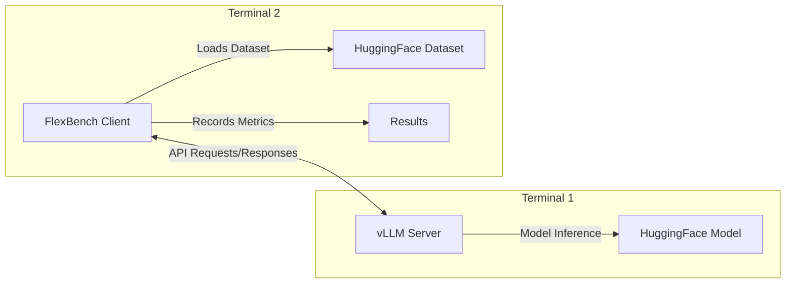

# FlexBench

A flexible benchmarking framework for language and vision models, with support for both MLPerf loadgen and vLLM backends.

## Features

- 🚀 Support for both Server (streaming) and Offline (batched) inference modes
- 🔄 Compatible with any HuggingFace model and dataset
- 🎯 MLPerf-compliant benchmarking with loadgen
- 🔍 Performance and accuracy evaluation
- 📊 Detailed metrics including TTFT, throughput, and latency percentiles
- 📈 QPS sweep mode for discovering performance characteristics

## Architecture

FlexBench uses a client-server architecture where the client (FlexBench) connects to a running vLLM server:



**Important:** The vLLM server and FlexBench client run in separate terminals. You must start the vLLM server first, then run FlexBench in another terminal.

## Inference Scenarios

FlexBench supports multiple inference scenarios based on MLPerf standards:

| Scenario       | Description                                                                 | Load Generation                                                                       | Use Case                        |
|----------------|-----------------------------------------------------------------------------|---------------------------------------------------------------------------------------|----------------------------------|
| **Server**     | Queries arrive following a Poisson distribution, mimicking real-world load. |              | Online serving, latency testing  |
| **Offline**    | All queries are sent at once, maximizing throughput.                        |            | Throughput benchmarking          |
| **SingleStream** | Queries are processed one at a time, measuring sequential latency (90th percentile). |       | Real-time, interactive, or mobile inference (e.g., autocomplete, AR) |
<!-- Add new modes here as needed -->

For more details on the MLPerf Inference Benchmark and the design of modes and metrics, refer to the [MLPerf Inference Benchmark paper](https://arxiv.org/pdf/1911.02549).

## Quick Start

### Installation

You can install FlexBench either by cloning the repository for local development, or directly from GitHub using pip or uv.

#### Option 1: Clone and Install Locally

```sh
# Clone the repository
git clone https://github.com/flexaihq/flexbench.git
cd flexbench
```

Then, create a virtual environment:

```sh
# Using uv (recommended)
curl -LsSf https://astral.sh/uv/install.sh | sh   # Optional: install uv
uv venv .venv
source .venv/bin/activate

# Or using standard venv
python -m venv .venv
source .venv/bin/activate
```

> Note: if not using `uv`, replace `uv pip` with `pip` in the commands below.

Install the required dependencies:

```sh
uv pip install -e .              # Basic installation for remote endpoints
# uv pip install -e ".[local]"   # For local model inference deployment
```

The `[local]` option installs additional dependencies required for local model inference with vLLM.

#### Option 2: Install Directly from GitHub

```sh
uv pip install git+https://github.com/flexaihq/flexbench.git             # Basic installation for remote endpoints
# uv pip install "git+https://github.com/flexaihq/flexbench.git[local]"  # For local model inference deployment
```

## Model & Dataset Support

### Models

FlexBench works with any HuggingFace model, with specialized chat templates for:

- Llama2 models (`meta-llama/Llama-2-*`)
- Llama3 models (`meta-llama/Llama-3-*`)
- DeepSeek models (`deepseek-ai/DeepSeek-*`)

### Dataset Support

#### Text Tasks

- Configurable column mapping for input text, output text, and system prompts
- Examples: `ctuning/MLPerf-OpenOrca`, `Open-Orca/OpenOrca`

#### Vision Tasks

- Support for `philschmid/amazon-product-descriptions-vlm` (prototype, WIP\*)

\* WIP: _Work in Progress_

## Usage

### Terminal 1: Start a vLLM Server

First, start the vLLM server in one terminal:

Single GPU:

```sh
vllm serve HuggingFaceTB/SmolLM2-135M-Instruct --disable-log-requests --max-model-len=2048
```

Multi-GPU:

```sh
CUDA_VISIBLE_DEVICES=0,1,2,3 vllm serve HuggingFaceTB/SmolLM2-135M-Instruct --disable-log-requests --max-model-len=2048 --tensor-parallel-size 4
```

### Terminal 2: Run FlexBench

WARNING: ensure the vLLM server is running before executing FlexBench

In a second terminal, run FlexBench to connect to the vLLM server:

```sh
# Standard mode with target QPS
python -m flexbench \
    --task text \
    --model-path HuggingFaceTB/SmolLM2-135M-Instruct \
    --api-server http://localhost:8000 \
    --scenario Server \
    --target-qps 10 \
    --dataset-path ctuning/MLPerf-OpenOrca \
    --dataset-input-column question \
    --dataset-system-prompt-column system_prompt \
    --total-sample-count 100
```

For sweep mode to discover performance characteristics:

```sh
python -m flexbench \
    --task text \
    --model-path HuggingFaceTB/SmolLM2-135M-Instruct \
    --api-server http://localhost:8000 \
    --scenario Server \
    --sweep \
    --num-points 20 \
    --dataset-path ctuning/MLPerf-OpenOrca \
    --dataset-input-column question \
    --dataset-system-prompt-column system_prompt \
    --total-sample-count 100
```

Note: use `LOG_LEVEL=DEBUG` env variable to enable debug logging.

## Key Parameters

| Parameter | Description | Available Options |
|-----------|-------------|-------------------|
| `--task` | Task type | `text`, `vision` (WIP) |
| `--scenario` | MLPerf scenario | `Server`, `Offline`, `SingleStream` |
| `--backend` | Benchmark implementation | `loadgen` (MLPerf-compliant), `vllm` (direct - _WIP_) |
| `--accuracy` | Evaluation mode | Flag to enable accuracy mode (default: performance). Needs `--dataset-output-column` to be set. Not compatible with `--sweep`. |
| `--dataset-output-column` | Reference text column (for accuracy mode) | String |
| `--target-qps` | Target query rate to achieve | Float |
| `--sweep` | Sweep mode | Flag to enable QPS sweep mode (incompatible with `--target-qps` and `--accuracy`). Automatically tests multiple QPS levels to discover performance limits and saturation points. |
| `--num-points` | Number of QPS points in sweep | Integer (default: 10) |
| `--batch-size` | Batch size, for Offline mode only | Integer |
| `--max-input-tokens` | Maximum number of tokens for input | Integer (longer inputs will be truncated) |
| `--fixed-input-length` | Fixed input length flag | Flag to pad inputs to exactly `--max-input-tokens` length |

For more details on each parameter, use `python -m flexbench --help`.

### Sweep Mode

Sweep mode automates the process of finding your model's performance curve by:

1. First determining the maximum throughput your model can handle
2. Then testing a range of QPS values (from low to high) to map the complete performance profile
3. Capturing metrics like latency and throughput at each level to identify optimal operating points

This is useful for capacity planning and understanding how your model performs under various load conditions. Results include comprehensive metrics at each tested QPS level.

### Offline Mode Batching Behavior

In Offline mode, the `--batch-size` parameter controls query processing:

- **Default (no value specified)**: All samples processed as a single batch for maximum throughput
- **Custom value**: All queries are still received at once, but processed in smaller chunks:
  - Queries divided into batches of specified size
  - Multiple worker threads process these batches in parallel
  - Each batch becomes a separate API call to the inference server

This maintains MLPerf methodology (submitting all queries at the start) while allowing flexible processing.

## Additional Options

For dataset configuration:

- `--dataset-input-column`: Input text column (required)
- `--dataset-output-column`: Reference text column (for accuracy mode)
- `--dataset-system-prompt-column`: System prompt column (optional)
- `--dataset-image-column`: Image column (for vision tasks, WIP)

For API configuration:

- `--api-server`: vLLM server URL
- `--api-token`: Authentication token for remote endpoints

## Testing & Development

Run a server on `localhost:8000` with:

```sh
vllm serve HuggingFaceTB/SmolLM2-135M-Instruct --disable-log-requests --max-model-len=2048
```

Then run the tests with:

```sh
pytest -v -s
```

## Using MLCommons CMX automation language

We are developing [MLCommons CMX automations](https://github.com/mlcommons/ck/tree/master/cmx4mlops/repo/flex.task/run-mlperf-inference-benchmark) 
to help users prepare, validate, and submit official MLPerf inference results using FlexBench.
These automations are based on our [MLPerf inference v5.0 submission](https://github.com/mlcommons/inference_results_v5.0/tree/main/open/FlexAI/measurements/cmx-flexbench-cuda-1xH100-vllm-0.7.3-pytorch-2.5.1-huggingface-16d94432c8704c14/DeepSeek-R1-Distill-Llama-8B/Server),
featuring DeepSeek-R1-Distill-Llama-8B and vLLM.


## License and Copyright

This project is licensed under the [Apache License 2.0](LICENSE.md).

© 2025 FlexAI

Portions of the code were adapted from the following MLCommons repositories, 
which are also licensed under the Apache 2.0 license:

* [mlcommons@inference](https://github.com/mlcommons/inference)
* [mlcommons@inference_results_v5.0](https://github.com/mlcommons/inference_results_v5.0)
* [mlcommons@ck](https://github.com/mlcommons/ck)
* [mlcommons@vllm-project](https://github.com/vllm-project/vllm)

## Authors and maintaners

[Daniel Altunay](https://www.linkedin.com/in/daltunay) and [Grigori Fursin](https://cKnowledge.org/gfursin) (FCS Labs)

## Contributing

We welcome contributions to this project!

If you have ideas, bug reports, or feature requests, please [open an issue](https://github.com/flexaihq/flexbench/issues).
To contribute code, feel free to submit a [pull request](https://github.com/flexaihq/flexbench/pulls).
By contributing, you agree that your contributions will be licensed under the same [Apache License 2.0](LICENSE.md).
