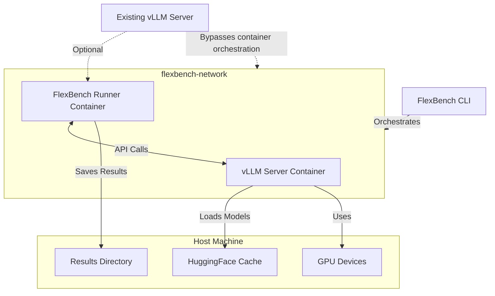
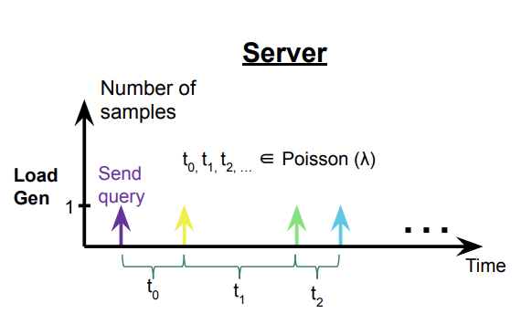
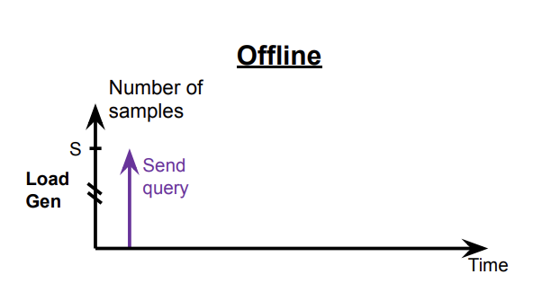
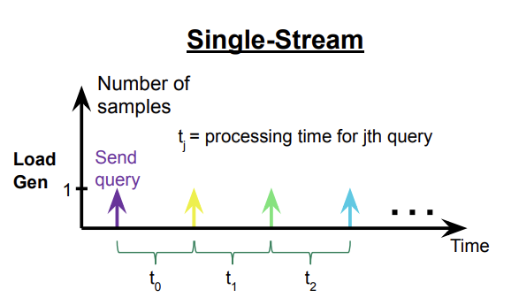

# FlexBench

A flexible benchmarking framework for text language models with automated Docker orchestration and MLPerf-compliant evaluation.

## Features

- **Zero-setup benchmarking** - Automatic Docker container orchestration
- **Universal hardware support** - Auto-detects CUDA, ROCm, ARM, and CPU devices
- **MLPerf-compliant scenarios** - Server, Offline, and SingleStream inference modes
- **Performance & accuracy evaluation** - Comprehensive metrics with built-in datasets
- **QPS sweep mode** - Automatic performance curve discovery
- **Existing server integration** - Connect to your running vLLM server

## Installation

```bash
# Install uv
curl -LsSf https://astral.sh/uv/install.sh | sh

# Install via clone
git clone https://github.com/flexaihq/flexbench.git
cd flexbench
uv venv
source .venv/bin/activate
uv pip install -e .

# Install via git URL
uv venv
source .venv/bin/activate
uv pip install git+https://github.com/flexaihq/flexbench.git
```

## Prerequisites

- **Docker** and **Docker Compose** (or `docker compose`)
- **NVIDIA Docker runtime** (for GPU support)

## Quick Start

FlexBench provides a single command with smart defaults for immediate benchmarking:

```bash
# View all available options
flexbench --help

# Basic benchmark with default dataset (ctuning/MLPerf-OpenOrca)
flexbench --model-path HuggingFaceTB/SmolLM2-135M-Instruct

# Larger model with GPU configuration
flexbench --model-path meta-llama/Llama-2-7b-chat-hf --target-qps 5

# QPS sweep to find performance limits
flexbench --model-path meta-llama/Llama-2-7b-chat-hf --sweep

# Accuracy evaluation mode
flexbench --model-path HuggingFaceTB/SmolLM2-135M-Instruct --mode accuracy

# Use existing vLLM server
flexbench --model-path meta-llama/Llama-2-7b-chat-hf --vllm-server http://localhost:8000

# Gated models (requires HuggingFace token)
export HF_TOKEN=your_hf_token_here
flexbench --model-path meta-llama/Llama-2-7b-chat-hf

# Or use CLI argument
flexbench --model-path meta-llama/Llama-2-7b-chat-hf --hf-token your_hf_token_here
```

FlexBench automatically handles Docker container orchestration, model loading, benchmarking, and result collection with zero manual setup.

## Architecture

FlexBench uses Docker Compose to orchestrate two containers that communicate over a dedicated network:



**Container Orchestration:**
- **vLLM Server Container**: Loads and serves the model via OpenAI-compatible API
- **FlexBench Runner Container**: Generates load, collects metrics, and saves results
- **Automatic networking**: Containers communicate over a dedicated Docker network
- **GPU allocation**: Automatic device detection and resource management

**External Server Option:**
- Use `--vllm-server` to connect to your existing vLLM server
- Bypasses vLLM container creation for maximum flexibility

## Inference Scenarios

FlexBench supports multiple inference scenarios based on MLPerf standards:

| Scenario       | Description                                                                 | Load Generation                                                                       | Use Case                        |
|----------------|-----------------------------------------------------------------------------|---------------------------------------------------------------------------------------|----------------------------------|
| **Server**     | Queries arrive following a Poisson distribution, mimicking real-world load. |              | Online serving, latency testing  |
| **Offline**    | All queries are sent at once, maximizing throughput.                        |            | Throughput benchmarking          |
| **SingleStream** | Queries are processed one at a time, measuring sequential latency (90th percentile). |       | Real-time, interactive, or mobile inference (e.g., autocomplete, AR) |

For more details on the MLPerf Inference Benchmark and the design of modes and metrics, refer to the [MLPerf Inference Benchmark paper](https://arxiv.org/pdf/1911.02549).

## Device Support

FlexBench automatically detects your hardware with `--device-type auto` (default):

**Detection Priority:** CUDA → ROCm → ARM → CPU

| Device Type | Default vLLM Image | Build Method | Hardware |
|-------------|-------------------|--------------|----------|
| **auto** | *Auto-detected* | *Varies by detected device* | Automatic hardware detection |
| **cuda** | `vllm/vllm-openai:latest` | Pull from registry | NVIDIA GPUs |
| **rocm** | `rocm/vllm:latest` | Pull from registry | AMD GPUs |
| **arm** | `vllm-arm-local:latest` | **Built from source** | ARM processors |
| **cpu** | `public.ecr.aws/q9t5s3a7/vllm-cpu-release-repo:v0.9.1` | Pull from registry | CPU-only systems |

**Note:** ARM devices require building vLLM from source since no pre-built ARM images are available. FlexBench automatically clones the vLLM repository and builds the image locally.

**Force specific device:**
```bash
# Force CPU even with GPUs available
flexbench --model-path HuggingFaceTB/SmolLM2-135M-Instruct --device-type cpu

# Force CUDA with specific GPUs
flexbench --model-path meta-llama/Llama-2-7b-chat-hf --device-type cuda --gpu-devices "0,1"
```

## Benchmark Modes

FlexBench supports multiple evaluation modes via `--mode`:

| Mode | Description | Usage |
|------|-------------|-------|
| **performance** | Benchmark throughput and latency (default) | `--mode performance` |
| **accuracy** | Evaluate model outputs against reference data | `--mode accuracy` |
| **all** | Run performance benchmark, then accuracy evaluation | `--mode all` |

**Examples:**
```bash
# Performance only (default)
flexbench --model-path HuggingFaceTB/SmolLM2-135M-Instruct

# Accuracy evaluation
flexbench --model-path HuggingFaceTB/SmolLM2-135M-Instruct --mode accuracy

# Both modes sequentially
flexbench --model-path HuggingFaceTB/SmolLM2-135M-Instruct --mode all
```

## Default Dataset

FlexBench uses the **cTuning/MLPerf-OpenOrca** dataset by default - the official MLPerf dataset for text inference benchmarking. Pre-configured column mappings:

- **Input column**: `question` (model prompts)
- **Output column**: `response` (reference answers for accuracy evaluation)

**Override defaults:**
```bash
# Use custom dataset
flexbench --model-path HuggingFaceTB/SmolLM2-135M-Instruct \
  --dataset-path your-org/your-dataset \
  --dataset-input-column your_input_column \
  --dataset-output-column your_output_column
```

## Sweep Mode

Sweep mode automatically discovers your model's performance characteristics by testing multiple QPS levels:

**How it works:**
1. **Discovery phase**: Finds the maximum QPS your model can handle
2. **Sweep phase**: Tests a range of QPS values from low to maximum
3. **Analysis**: Captures latency, throughput, and saturation points at each level

**Usage:**
```bash
# Basic sweep with 10 QPS points (default)
flexbench --model-path meta-llama/Llama-2-7b-chat-hf --sweep

# Custom sweep with 5 QPS points
flexbench --model-path meta-llama/Llama-2-7b-chat-hf --sweep --num-sweep-points 5
```

**Benefits:**
- **Capacity planning**: Understand performance limits
- **Optimization**: Find optimal operating points
- **Profiling**: Complete performance curve analysis

Note: Sweep mode is incompatible with `--target-qps` (automatically determines QPS range) and `--mode accuracy` (performance analysis only).

## Key Configuration Options

### Basic Options
```bash
# Model and target QPS
flexbench --model-path meta-llama/Llama-2-7b-chat-hf --target-qps 5

# MLPerf scenario (default: Offline)
flexbench --model-path HuggingFaceTB/SmolLM2-135M-Instruct --scenario Server

# Sample count and batch size
flexbench --model-path HuggingFaceTB/SmolLM2-135M-Instruct --total-sample-count 200 --batch-size 10
```

### GPU Configuration
```bash
# Specific GPU devices (uses only first GPU by default)
flexbench --model-path meta-llama/Llama-2-7b-chat-hf --gpu-devices "0,1,2"

# Multi-GPU with tensor parallelism (REQUIRED for utilizing multiple GPUs)
flexbench --model-path meta-llama/Llama-2-7b-chat-hf --gpu-devices "0,1,2" --tensor-parallel-size 3

# Tensor parallelism with auto-detected GPUs
flexbench --model-path meta-llama/Llama-2-7b-chat-hf --tensor-parallel-size 2

# Memory limits
flexbench --model-path meta-llama/Llama-2-7b-chat-hf --vllm-memory-limit 16g
```

**Important:** When using multiple GPUs, you must specify `--tensor-parallel-size` to match the number of GPUs you want to use. Without this parameter, only the first GPU will be utilized, even if multiple GPUs are specified with `--gpu-devices`.

### External vLLM Server
```bash
# Connect to existing server
flexbench --model-path meta-llama/Llama-2-7b-chat-hf \
  --vllm-server http://localhost:8000 \
  --vllm-server-token your-auth-token
```

### Custom Images
```bash
# Use custom vLLM image
flexbench --model-path meta-llama/Llama-2-7b-chat-hf \
  --vllm-image myregistry.example.com/custom-vllm:latest
```

### Gated Models
```bash
# For gated models (e.g., Llama, Mistral), provide HuggingFace token
export HF_TOKEN=your_hf_token_here
flexbench --model-path meta-llama/Llama-2-7b-chat-hf

# Or use CLI argument
flexbench --model-path meta-llama/Llama-2-7b-chat-hf --hf-token your_hf_token_here
```

**Note:** Gated models require authentication with HuggingFace. The `HF_TOKEN` environment variable is automatically detected, or you can pass it directly via `--hf-token`.

For complete options: `flexbench --help`

## Using MLCommons CMX automation language

We are developing [MLCommons CMX automations](https://github.com/mlcommons/ck/tree/master/cmx4mlops/repo/flex.task/run-mlperf-inference-benchmark)
to help users prepare, validate, and submit official MLPerf inference results using FlexBench.
These automations are based on our [MLPerf inference v5.0 submission](https://github.com/mlcommons/inference_results_v5.0/tree/main/open/FlexAI/measurements/cmx-flexbench-cuda-1xH100-vllm-0.7.3-pytorch-2.5.1-huggingface-16d94432c8704c14/DeepSeek-R1-Distill-Llama-8B/Server),
featuring DeepSeek-R1-Distill-Llama-8B and vLLM.


## License and Copyright

This project is licensed under the [Apache License 2.0](LICENSE.md).

© 2025 FlexAI

Portions of the code were adapted from the following MLCommons repositories,
which are also licensed under the Apache 2.0 license:

- [mlcommons@inference](https://github.com/mlcommons/inference)
- [mlcommons@inference_results_v5.0](https://github.com/mlcommons/inference_results_v5.0)
- [mlcommons@ck](https://github.com/mlcommons/ck)
- [mlcommons@vllm-project](https://github.com/vllm-project/vllm)

## Authors and maintaners

[Daniel Altunay](https://www.linkedin.com/in/daltunay) and [Grigori Fursin](https://cKnowledge.org/gfursin) (FCS Labs)

## Contributing

We welcome contributions to this project!

If you have ideas, bug reports, or feature requests, please [open an issue](https://github.com/flexaihq/flexbench/issues).
To contribute code, feel free to submit a [pull request](https://github.com/flexaihq/flexbench/pulls).
By contributing, you agree that your contributions will be licensed under the same [Apache License 2.0](LICENSE.md).
