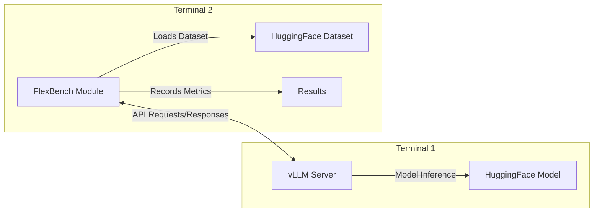

# FlexBench Module Documentation

This document covers the direct Python module usage of FlexBench. For most users, we recommend using the [FlexBench CLI](../README.md) which provides automatic Docker orchestration.

## When to Use the Module

Use the Python module directly when you need:
- **Development and debugging**: Direct access to all APIs and configurations
- **Custom vLLM setups**: Your own vLLM server with specific configurations
- **Integration into existing systems**: Embedding FlexBench in larger applications
- **Fine-grained control**: Custom benchmark workflows and data processing

## Prerequisites

- Python 3.12+
- A running vLLM server (you must manage this separately)
- FlexBench installed: `pip install -e .` or `pip install git+https://github.com/flexaihq/flexbench.git`

## Architecture



**Important:** The vLLM server and FlexBench module run in separate processes/terminals. You must start the vLLM server first, then run FlexBench in another terminal pointing to the server.

## Basic Usage

### Step 1: Start vLLM Server

```bash
# Single GPU
vllm serve HuggingFaceTB/SmolLM2-135M-Instruct \
  --disable-log-requests \
  --max-model-len=2048

# Multi-GPU with tensor parallelism
CUDA_VISIBLE_DEVICES=0,1,2,3 vllm serve HuggingFaceTB/SmolLM2-135M-Instruct \
  --disable-log-requests \
  --max-model-len=2048 \
  --tensor-parallel-size=4
```

### Step 2: Run FlexBench Module

**⚠️ WARNING:** Ensure the vLLM server is ready before running FlexBench.

```bash
# Basic performance benchmark
python -m flexbench \
  --task text \
  --model-path HuggingFaceTB/SmolLM2-135M-Instruct \
  --api-server http://localhost:8000 \
  --scenario Server \
  --target-qps 10 \
  --dataset-path ctuning/MLPerf-OpenOrca \
  --dataset-input-column question \
  --total-sample-count 100

# Sweep mode to discover performance characteristics
python -m flexbench \
  --task text \
  --model-path HuggingFaceTB/SmolLM2-135M-Instruct \
  --api-server http://localhost:8000 \
  --scenario Server \
  --sweep \
  --num-points 20 \
  --dataset-path ctuning/MLPerf-OpenOrca \
  --dataset-input-column question \
  --total-sample-count 100

# Accuracy evaluation
python -m flexbench \
  --task text \
  --model-path HuggingFaceTB/SmolLM2-135M-Instruct \
  --api-server http://localhost:8000 \
  --scenario Server \
  --target-qps 5 \
  --accuracy \
  --dataset-path ctuning/MLPerf-OpenOrca \
  --dataset-input-column question \
  --dataset-output-column response \
  --total-sample-count 100
```

## Module-Specific Arguments

The module requires the `--api-server` argument that specifies where your vLLM server is running:

```bash
--api-server http://localhost:8000    # Local vLLM server
--api-server http://remote-host:8000  # Remote vLLM server  
--api-server https://api.example.com  # Remote API with HTTPS
```

All other arguments are shared with the CLI version. See the main [README.md](../README.md) for complete parameter documentation.

## Advanced Configuration

### Custom vLLM Server Settings

You have full control over vLLM server configuration:

```bash
# Custom model settings
vllm serve microsoft/DialoGPT-medium \
  --host 0.0.0.0 \
  --port 8080 \
  --max-model-len=1024 \
  --gpu-memory-utilization=0.8 \
  --tensor-parallel-size=2

# Then connect FlexBench
python -m flexbench \
  --api-server http://localhost:8080 \
  --model-path microsoft/DialoGPT-medium \
  # ... other args
```

### Environment Variables

```bash
# Enable debug logging
LOG_LEVEL=DEBUG python -m flexbench ...

# Custom HuggingFace cache
HF_HOME=/custom/cache python -m flexbench ...
```

### Custom Tokenizer

```bash
python -m flexbench \
  --tokenizer-path-override /path/to/custom/tokenizer \
  # ... other args
```

## Troubleshooting

### vLLM Server Issues

```bash
# Check if vLLM server is running
curl http://localhost:8000/health

# Check vLLM server logs
# (depends on how you started it)

# Test with a simple request
curl http://localhost:8000/v1/completions \
  -H "Content-Type: application/json" \
  -d '{
    "model": "HuggingFaceTB/SmolLM2-135M-Instruct",
    "prompt": "Hello, world!",
    "max_tokens": 10
  }'
```

### Connection Issues

```bash
# Check network connectivity
ping localhost
telnet localhost 8000

# Verify API server URL
python -c "import requests; print(requests.get('http://localhost:8000/health').json())"
```

### Performance Issues

```bash
# Monitor GPU usage
nvidia-smi -l 1

# Monitor vLLM server process
top -p $(pgrep -f vllm)
```

## Comparison: CLI vs Module

| Aspect | CLI (Recommended) | Module |
|--------|-------------------|---------|
| **Setup** | Automatic Docker orchestration | Manual vLLM server management |
| **Isolation** | Isolated containers | Shared host environment |
| **GPU Management** | Automatic device allocation | Manual CUDA_VISIBLE_DEVICES |
| **Dependencies** | Docker + Docker Compose | Python + vLLM |
| **Debugging** | Container logs, --no-cleanup | Direct process access |
| **Customization** | Limited to supported args | Full vLLM configuration control |
| **Reproducibility** | High (containerized) | Medium (depends on environment) |
| **Use Case** | Production, CI/CD, standard benchmarks | Development, custom setups, debugging |

## Migration from CLI

If you have CLI commands, you can convert them to module usage:

```bash
# CLI version
flexbench --task text --model-path MODEL --scenario Server --target-qps 10 \
          --dataset-path DATA --dataset-input-column question

# Module equivalent (requires running vLLM server separately)
vllm serve MODEL --disable-log-requests --max-model-len=2048 &
python -m flexbench --task text --model-path MODEL --api-server http://localhost:8000 \
                   --scenario Server --target-qps 10 \
                   --dataset-path DATA --dataset-input-column question
```

## Getting Help

```bash
# Module-specific help
python -m flexbench --help

# CLI help (for comparison)
flexbench --help
```

For issues specific to module usage, please check:
1. vLLM server logs and status
2. Network connectivity to the API server
3. Model and dataset accessibility
4. Python environment and dependencies

For general FlexBench issues, see the main [README.md](../README.md) or [open an issue](https://github.com/flexaihq/flexbench/issues).
